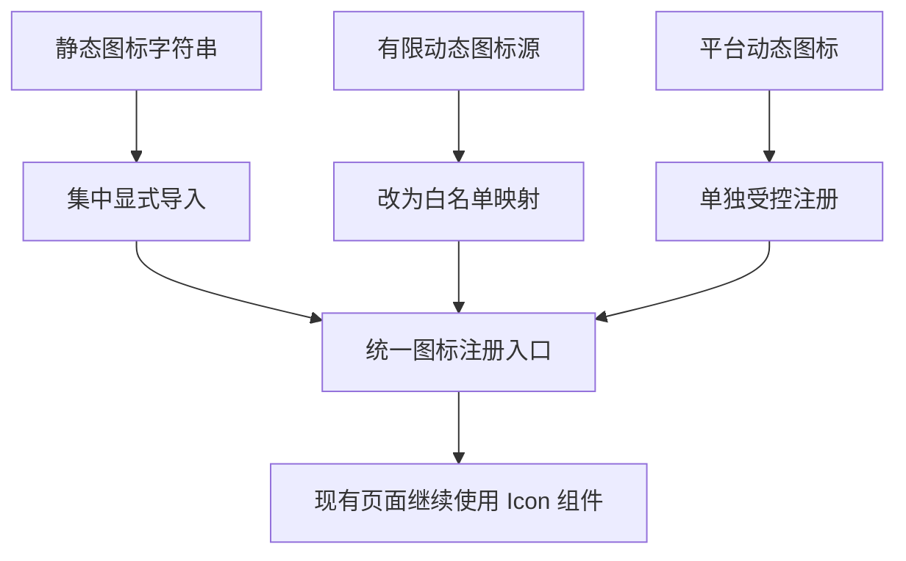

# Iconify 最小侵入按需打包方案

## 目标

在不引入 prebuild 脚本、不增加构建前生成步骤的前提下，让项目中的 Iconify 图标尽可能只打包实际使用到的图标，并保持现有页面结构与组件调用方式基本不变。

## 当前现状

- 项目普遍使用 [`<Icon icon='...' />`](src/components/SearchBase.vue:121) 与 [`<Icon :icon='...' />`](src/App.vue:47)
- 依赖包含 [`@iconify/vue`](package.json:21)、[`@iconify-json/lucide`](package.json:19)、[`@iconify-json/solar`](package.json:20)、[`@iconify-json/eos-icons`](package.json:34)
- 存在大量静态字符串图标名，如 [`lucide:search`](src/components/SearchBase.vue:121)
- 存在有限动态来源，主要是：
  - [`SEARCH_TYPE_MAP`](src/composables/useSavedSearches.js:13)
  - [`getResultDisplay().placeholderIcon`](src/pages/Home.vue:178)
  - [`getSexIcon()`](src/pages/CharacterSearch.vue:539)
  - [`section.icon`](src/pages/Settings.vue:315)
  - [`opt.icon`](src/pages/Settings.vue:343)
  - [`link.icon`](src/pages/VnDetail.vue:2312)
- 存在真正运行时拼接的平台图标：[`simple-icons:${plat}`](src/components/ReleaseList.vue:417)
- 存在少量非 lucide 集图标：[`eos-icons:loading`](src/components/SearchBase.vue:126)、[`solar:star-broken`](src/pages/VnDetail.vue:2564)、[`solar:star-bold`](src/pages/VnDetail.vue:2580)

## 方案总览

采用 3 层方案：

### 第一层：集中注册静态图标

新增一个运行时注册模块，例如 [`src/icons/register-icons.js`](src/main.js:1) 同级位置，由它：

- 从各个 `@iconify-json/*` 包中显式导入项目实际使用的图标数据
- 使用 Iconify 提供的运行时注册能力统一注册
- 在 [`src/main.js`](src/main.js:1) 启动阶段执行一次

效果：

- Vite 只会打包被 import 到的图标数据
- 不依赖扫描脚本
- 不要求重写全部模板为单图标组件
- 对现有 [`<Icon icon='lucide:*' />`](src/components/SearchBase.vue:121) 写法侵入最小

### 第二层：收敛有限动态源为白名单

把目前可枚举的动态图标来源改成统一常量映射，而不是任意字符串拼接。

建议改造点：

- [`SEARCH_TYPE_MAP`](src/composables/useSavedSearches.js:13)
- [`getResultDisplay().placeholderIcon`](src/pages/Home.vue:178)
- [`getSexIcon()`](src/pages/CharacterSearch.vue:539)
- [`section.icon`](src/pages/Settings.vue:315)
- [`opt.icon`](src/pages/Settings.vue:343)
- [`link.icon`](src/pages/VnDetail.vue:2312)

实现方式：

- 新增 [`src/icons/icon-names.js`](src/main.js:1) 输出受控常量
- 所有上述位置仅引用白名单中的名称
- [`src/icons/register-icons.js`](src/main.js:1) 与白名单保持同源，避免漏注册

效果：

- 保留动态选择能力
- 但动态值可控、可枚举、可注册

### 第三层：平台图标单独处理

[`simple-icons:${plat}`](src/components/ReleaseList.vue:417) 是唯一真正不适合直接静态枚举的点，但项目里的平台值实际上可由筛选项与数据模型推导出有限集合。

建议做法：

- 新增 [`src/icons/platform-icons.js`](src/main.js:1)
- 根据 [`platformOptions`](src/pages/ReleaseSearch.vue:67) 与 [`platformOptions`](src/pages/VnSearch.vue:81) 收敛出支持的平台代码白名单
- 建立 `plat -> iconName` 或 `plat -> iconData` 映射
- 将 [`simple-icons:${plat}`](src/components/ReleaseList.vue:417) 改为查表，如 `getPlatformIcon(plat)`
- 未命中时回退到一个通用图标，例如 [`lucide:monitor`](src/pages/ReleaseSearch.vue:441) 或不渲染

效果：

- 平台图标也进入受控集合
- 避免继续保留开放式前缀拼接
- 仍然不需要 prebuild

## 具体实施步骤

1. 新增 [`src/icons/icon-names.js`](src/main.js:1)
   - 汇总 Lucide、Solar、Eos、Simple Icons 的受控名称常量
   - 导出搜索类型图标、占位图标、状态图标、设置页图标、平台图标 key

2. 新增 [`src/icons/register-icons.js`](src/main.js:1)
   - 显式导入所有受控图标数据
   - 统一调用 Iconify 运行时注册 API
   - 导出 `registerAppIcons()`

3. 在 [`src/main.js`](src/main.js:1) 中调用 `registerAppIcons()`
   - 作为应用初始化的一部分
   - 不改动路由与页面结构

4. 收敛有限动态图标源
   - 更新 [`src/composables/useSavedSearches.js`](src/composables/useSavedSearches.js:13)
   - 更新 [`src/pages/Home.vue`](src/pages/Home.vue:178)
   - 更新 [`src/pages/CharacterSearch.vue`](src/pages/CharacterSearch.vue:539)
   - 更新 [`src/pages/CharacterDetail.vue`](src/pages/CharacterDetail.vue:307)
   - 更新 [`src/pages/Settings.vue`](src/pages/Settings.vue:315)
   - 更新 [`src/pages/VnDetail.vue`](src/pages/VnDetail.vue:2312)

5. 收敛平台图标
   - 更新 [`src/components/ReleaseList.vue`](src/components/ReleaseList.vue:417)
   - 必要时补充平台映射来源于 [`src/pages/ReleaseSearch.vue`](src/pages/ReleaseSearch.vue:67) 与 [`src/pages/VnSearch.vue`](src/pages/VnSearch.vue:81)

6. 验证构建与回归
   - 运行构建确认没有缺失图标
   - 检查搜索页、详情页、设置页、主页、列表页的图标显示

## 回滚策略

如果实施过程中某一类动态图标改造成本高于预期，可分层回滚：

- 保留 [`src/icons/register-icons.js`](src/main.js:1) 与静态 Lucide 收敛
- 暂缓 [`simple-icons:${plat}`](src/components/ReleaseList.vue:417) 的完全查表，仅先处理 Lucide Solar Eos
- 若个别 [`link.icon`](src/pages/VnDetail.vue:2312) 来源过散，可先只把其来源改成白名单常量，不立即重构渲染层

## 预期结果

- Lucide Solar Eos 图标不再按整包运行时自由解析
- 绝大多数图标转为显式 import 后的按需打包
- 平台图标从开放拼接收敛为受控集合
- 无需 prebuild、无额外生成脚本、改动集中在图标入口与少量动态源

## 建议切换

下一步应切换到 [`code`](package.json:1) 模式实施，优先完成图标注册入口与有限动态源收敛，再处理平台图标查表。