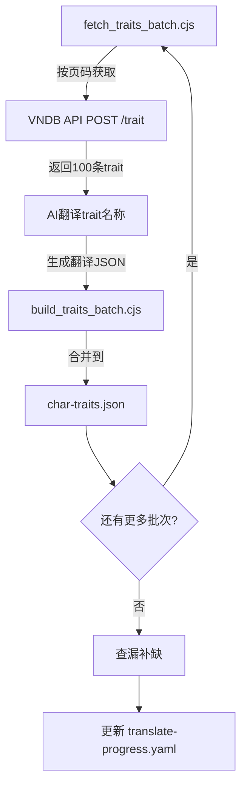

# 角色特征 (Traits) 批量翻译计划

## 背景

- `char-traits.json` 当前有 264 条手动翻译（覆盖率 8.0%）
- VNDB API 共有 3327 个特征 (i1~i4218)
- 目标：通过 API 批量获取并翻译所有特征，达到 100% 覆盖

## 架构流程

## 执行步骤

### Step 1: 创建 fetch_traits_batch.cjs

脚本功能：
- 接受参数：`--page <N>` (页码，从1开始)
- 调用 VNDB API `POST /trait`，每页100条，按 `id` 升序排列
- 请求字段：`id, name, description, group_id, group_name, char_count`
- 输出：`docs/traits_batch_<N>.json`，包含原始 trait 数据

### Step 2: 创建 build_traits_batch.cjs

脚本功能：
- 接受参数：`--batch <N>` (批次号)
- 读取 `docs/traits_translated_<N>.json`（AI翻译后的结果）
- 合并到 `src/i18n/locales/char-traits.json`
- 保留已有的翻译，不覆盖

### Step 3: 逐批翻译 (33批 x 100条)

每批工作流：
1. 运行 `fetch_traits_batch.cjs --page <N>` 获取原始数据
2. AI 读取原始数据，翻译 trait 名称为中文
3. 生成 `docs/traits_translated_<N>.json`
4. 运行 `build_traits_batch.cjs --batch <N>` 合并到主文件

翻译规则：
- Key = VNDB API 返回的英文特征名 (name 字段)
- Value = 中文翻译
- 参考已有的 264 条翻译风格
- 专有名词保留或音译（如 Tsundere → 傲娇）
- group_name 作为上下文参考，不作为 Key

### Step 4: 查漏补缺

- 再次获取全量 trait 列表
- 对比 char-traits.json 中已有的 Key
- 补充遗漏的特征翻译

### Step 5: 更新进度文件

- 更新 `docs/translate-progress.yaml` 中 traits 部分
- 记录翻译完成状态

## 关键文件

| 文件 | 说明 |
|------|------|
| `fetch_traits_batch.cjs` | API 获取脚本（新建） |
| `build_traits_batch.cjs` | 翻译合并脚本（新建） |
| `src/i18n/locales/char-traits.json` | 翻译结果文件（更新） |
| `docs/traits_batch_<N>.json` | 每批原始数据（临时） |
| `docs/traits_translated_<N>.json` | 每批翻译结果（临时） |
| `docs/translate-progress.yaml` | 进度追踪（更新） |

## 注意事项

1. API 无需认证即可查询 trait 数据
2. 每页最多100条，3327条需要 34 页（最后一页 27 条）
3. 已有的 264 条翻译需要保留，新翻译补充到后面
4. 翻译风格需与现有条目保持一致
